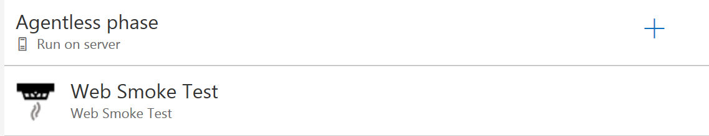
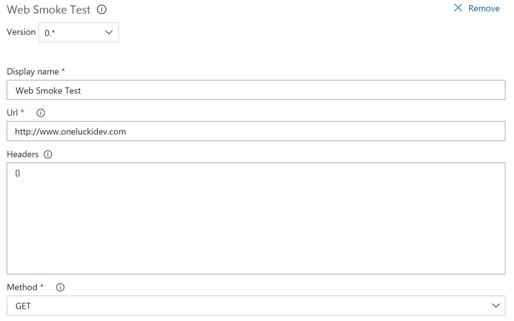

# VSTS Release Quality Gate Smoke Test
TFS and VSTS Quality Gate task for a simple web smoke test.

**For an Agent-based web smoke test task that will retry and hit multiple URLs (good for web farm scenarios), please see this task:
https://marketplace.visualstudio.com/items?itemName=OneLuckiDev.release-web-smoke-test-task

## Functionality
Add to the server Quality Gate after a release to ensure that a web page is available prior to releasing to a later environment

## Input Value usage
**Url**
 the url  to call. The address information should include the protocol desired (http:// or https://). 

## Smoke Test task goals

Simple task to test the availability of a web applicaiton or api after a deployment to verify that there is some expected response.  This allows for a sanity check at the end of the release in to an environment to verify that what was deployed is actually functional.

## Images

## Source
[GitHub](https://github.com/jeffpriz/vsts-smoke-test-gate)

## Issues
[File an issue](https://github.com/jeffpriz/vsts-smoke-test-gate/issues)

## Credits
[Jeff Przylucki](http://www.oneluckidev.com)

Icon - Smoke Detector by Arthur Shlain from the Noun Project

